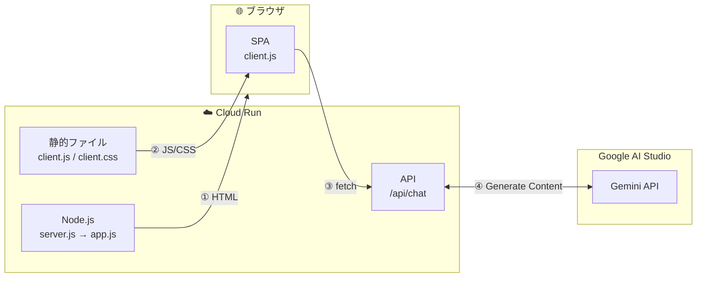

<!-- @format -->

# Dose model work?

Gemini のモデルが使用できるかどうか簡単に確認できるアプリ

## 想定用途

- GeminiAPI でモデル名を指定して疎通確認（例: `gemini-2.5-flash-preview-09-2025`）
- 無料枠で使用できるモデルなのか確認（例: `gemini-3-pro-preview`）
- 各モデルの応答速度を簡易的に測定

## ローカルでの使用

```bash
# 開発サーバー起動
# ブラウザで http://localhost:5173 にアクセス
pnpm dev

# 型チェック
npx tsc --noEmit

# ビルド
# ビルド成果物は `dist/`（サーバー）、`dist/client/`（フロント）に出力されます
pnpm build

# プレビュー（ビルド後の動作確認）
pnpm preview
```

## デプロイコマンド

CloudRun にデプロイするコマンド

```bash
export GEMINI_API_KEY="your_free_api_key_here"
export GEMINI_API_KEY_PAID="your_paid_api_key_here"
export NODE_ENV=production

gcloud run deploy my-hono-app \
  --source . \
  --allow-unauthenticated \
  --region=asia-northeast1 \
  --set-env-vars="GEMINI_API_KEY=${GEMINI_API_KEY},GEMINI_API_KEY_PAID=${GEMINI_API_KEY_PAID},NODE_ENV=${NODE_ENV}"
```

## 通信の流れ


